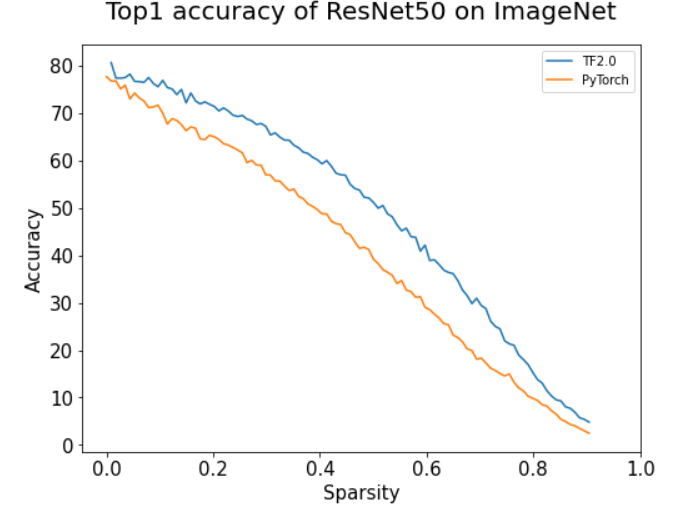

# Importance Estimation for Neural Network Pruning

This repository contains unofficial TensorFlow 2.x based implementation of Importance Estimation for Neural Network Pruning, CVPR 2019 paper.

This is re-write of PyToch 1.0 based implementation available [here](https://github.com/NVlabs/Taylor_pruning). Unlike the official code, this repository only implements Taylor Gate, which corresponds to Gate after BN in the paper (Best method in the paper).

## Environment
- Tensorflow 2.x

## Getting started

### 1. Download ImageNet

You can download ImageNet automatically if you use `huggingface-cli login` and run the code.

### 2. Train the Model

	python main.py
    
    
## Result

